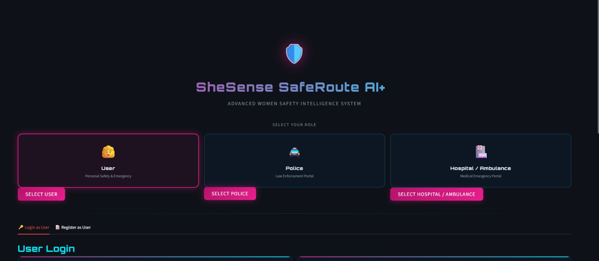
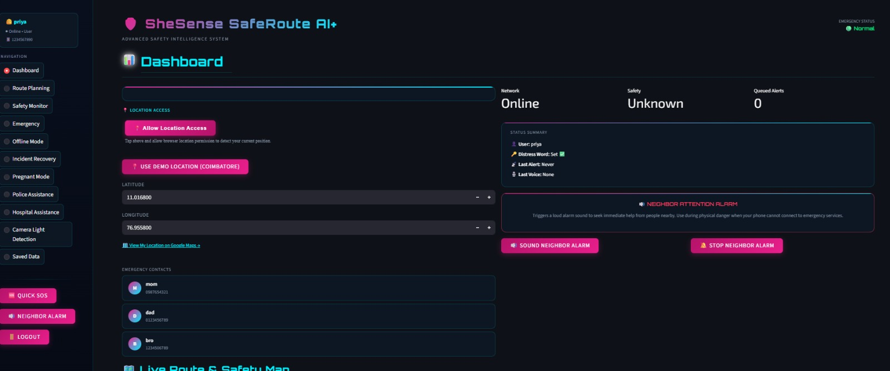
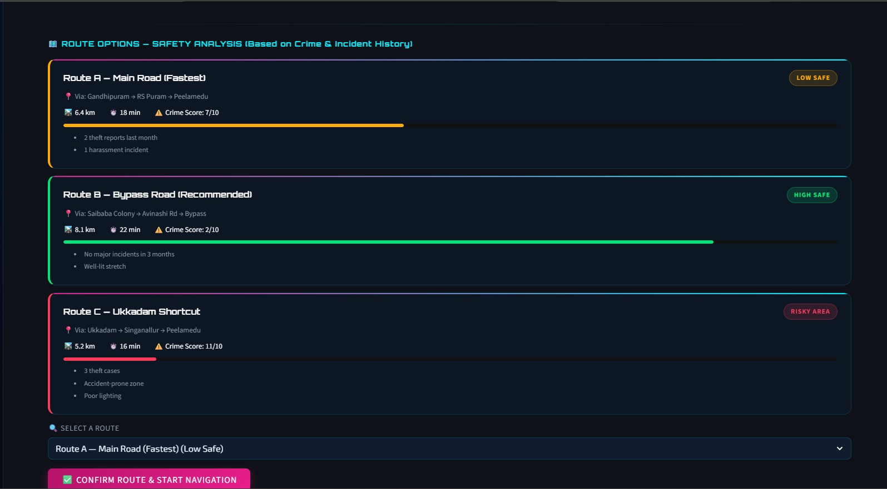
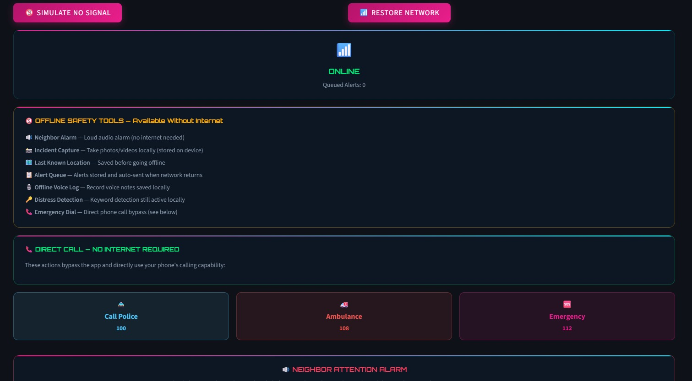
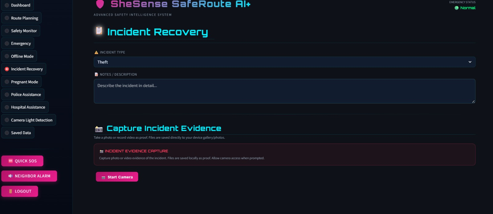
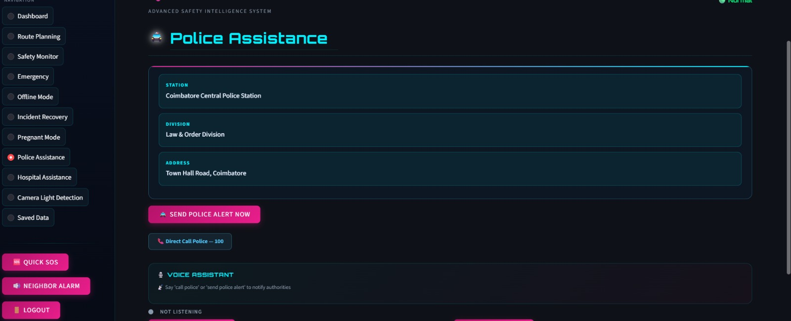
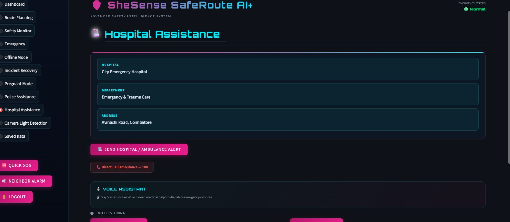

# SheSense AI – SafeRoute System 🚨

## 📌 Description
SheSense SafeRoute AI+ is an AI-based safety and navigation system designed to enhance personal security.  
It uses smart route analysis, voice-triggered emergency alerts, and real-time monitoring.

## 🚀 Features
- Smart route safety analysis  
- Voice-triggered emergency alerts  
- OTP-based login system  
- Distress word detection  
- Offline alert system  
- Modules for police, hospital, and pregnancy assistance  

## 🛠️ Technologies Used
- Python  
- Machine Learning  
- AI-based detection
## screenshots
-
-
-
-
-
-
-

## project structure
-shesenseai/|----ps.py|----README.md|images/output.jpeg|output1.jpeg|output2.jpeg|output3.jprg|output4.jpeg|output5.jpeg|output6.jpeg

- ## ▶️ How to Run
1. Install Python  
2. Run the file:
   python ps.py  

## 🎯 Future Improvements
- Mobile app integration  
- Real-time GPS tracking  
- Deep learning enhancements  
## 👩‍💻 Author
Sabarmathi
